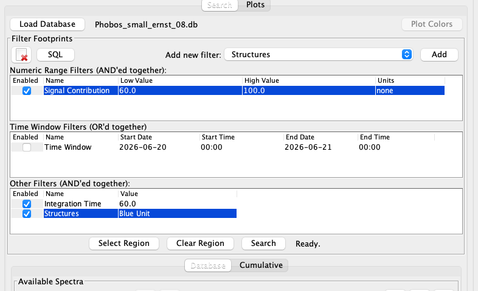
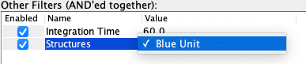
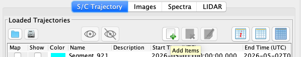
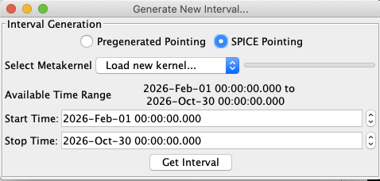

## Download

Latest version: VERSIONXXXXXX

The SBMT MEGANE Version is currently available for Mac, Windows, and Linux systems. It is distributed as a self-contained zip file.

Users new to the SBMT or those wanting to learn more about its functionality can access a [user guide and tutorials from the main website](http://sbmt.jhuapl.edu/index.php#Getting-Started). 

To install the SBMT for Windows or Linux, download the file appropriate for your operating system, navigate to the sbmt folder, and run the "runsbmt" program.

   -  Linux: [VERSIONXXXXXX-linux-x64.zip](releases/VERSIONXXXXXX-linux-x64.zip)
   -  Windows: [VERSIONXXXXXX-windows-x64.zip](releases/VERSIONXXXXXX-windows-x64.zip)

To install the SBMT for macOS, download the appropriate file below

   -  macOS (10.15 Catalina or later): [VERSIONXXXXXX.pkg](releases/VERSIONXXXXXX.pkg)

NOTE: Starting with the 0.7.7 release Mac OS Catalina (10.15) is supported. The install process for the software for all mac users has changed to accommodate this support: 1) Right click the downloaded .pkg and select "Open", select open again when it warns about not being able to scan for malicious software, and follow instructions in the install wizard. 2) SBMT will now appear as an application in the /Applications/SBMT folder. The functionality of the tool should be unchanged. Please contact sbmt@jhuapl.edu if you encounter installation issues.

NOTE: On a Mac, built in Apple security measures may cause you to see an error message the first time you try to run a downloaded version of the SBMT: "SBMT.app can't be opened because the identity of the developer cannot be confirmed." Rest assured that the SBMT is safe to run. To open the SBMT for the first time, right-click on the "SBMT" icon in your /Applications/SBMT folder, select "open". The SBMT should then open without further problems, and this additional step will not be necessary until you download a new version of the tool.

## Resources

### Databases

Under the MEGANE -> Search tab you can load a datbase.  Please use this one (as of 3.25.22):

[MEGANE Database](resources/Phobos_small_ernst_08.db)

With this database loaded, the filter in the table below become	enabled.  You can then add filters to narrow down the search.

If you load in a structures file (see below) and add a Structures filter, you can select which one you want to search against. 	Composite structure search is coming soon.

### SPICE Files

If you with to use the observing conditions pane to look at trajectories you will need these files:

[SPICE Kernel Files](resources/megane_spice.zip)

To use these files, unzip the file above somewhere on your system.  In the Observing Conditions pane of SBMT, you will see an icon to add a new Trajectory element:

When you click that, the following dialog will appear:

Click on "SPICE Pointing", and from the drop down box, choose "Load New Kernel".  Select the metakernel (.mk) file you would like to use.  Then select a time range to display, and lastly click "Get Interval".

Once you've loaded the kernel, it is available when you run SBMT in the future.

### Structures Files

Structures denoting regions of the surface can be ingested using the following file:

[Blue Unit Structures Files](resources/Phobos_blue_simple)

To load this file, go to the Structures tab in SBMT, click the "Load" button, and choose the file you have saved to your computer.

## System requirements

* Java 8 1.8.0_101 or above
* Windows 7 or higher (64-bit)
* Linux, recent distributions (64-bit)
* Mac OS X version 10.10 or higher (64-bit Intel-based Macs only)

## Release Notes

Release notes of the SBMT can be found [here](http://sbmt.jhuapl.edu/Release-Notes.php).

## Previous releases

Previous releases of the SBMT can be found [here](http://sbmt.jhuapl.edu/Previous-Releases.php).

##Terms and conditions
Please acknowledge use of the Small Body Mapping Tool in your abstracts and publications. This courtesy helps us to demonstrate how the SBMT is being used and, therefore, contributes to the SBMT's continued availability, maintenance, and development. We are excited to see how the SBMT is being used by the community. A list of publications that have made use of the SBMT will soon be available on this website.

Currently, the best reference to cite for the SBMT is [Ernst et al., 2018, The Small Body Mapping Tool (SBMT) for Accessing, Visualizing, and Analyzing Spacecraft Data in Three Dimensions, LPSC 49, abstract no. 1043](http://sbmt2.jhuapl.edu/pubs/Ernst_LPSC2018_SBMT.pdf).

If you have used the SBMT to create or map structures, you can share your data with the community by adding them to the SBMT structures database. If you would like to share your data in this way, please email [sbmt@jhuapl.edu](mailto:sbmt@jhuapl.edu).

